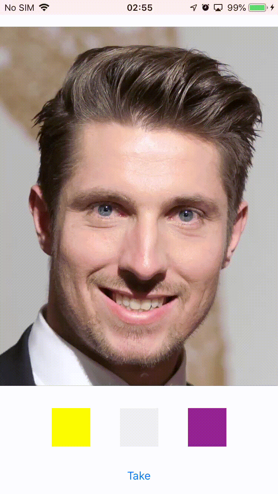

# HairColorChange

Change HairColor with deep learning model.
it provides both Swift and Objective-c.
This engine detects three lines. (Heard Line, Life Line, Heart Line)

How to use this?
1. Copy/Past two frameworks.
- opencv2.framework.
- HairChange.framework

2. Add these two frameworks as Embedded Binaries
